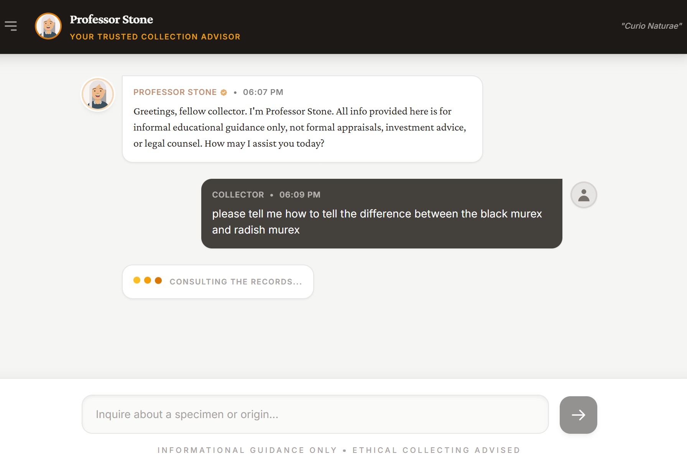

# Professor Stone: Your Trusted Collection Advisor

Professor Stone assists collectors of minerals, fossils, meteorites, and shells with specimen research and pricing.  A user types prompts into the chatbot and Professor Stone searches the web for detailed information, citing sources in its replies.  The Professor may assist you with the following:

- Specimen identification on site, in the field, or at the rock show
- Assistance in verifing the prominance of a too good to be true specimen is real or fake
- Determining a fair price for a specimen and quality grading criteria
- Guidance on ethical collecting and how to tell if that specimen you saw at a show was illegaly obtained

I have used this app for all of the above.

This was inspired from a custom ChatGPT app I created with the same name.  You can also see it here: https://shorturl.at/bWAhQ

I have used the Professor Stone CharGPT app to research mineral specimens I have bought or sold and help identify ones from collections I have obtained recently.

## Run Locally

**Prerequisites:**  Node.js

1. Install dependencies:
   `npm install`
2. Set the `GEMINI_API_KEY` in [.env.local](.env.local) to your Gemini API key.  I recommend generating API keys using Google AI studio.
3. Run the app:
   `npm run dev`

## Notes

The Professor does through research before answering initial prompts, which can take a few minutes.  For very rare species which there is not much information about, this may take even longer.

